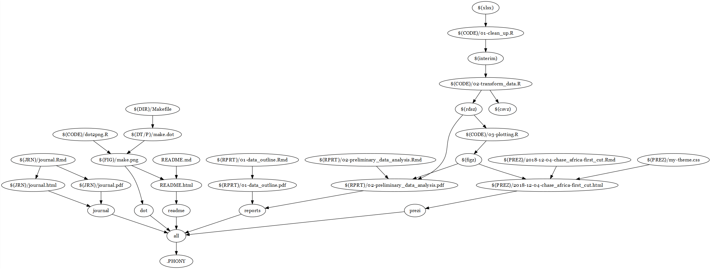

# The impact of integrated healthcare and family planning services in marginalised communities in rural areas in Kenya and Uganda

This is the repository for the analysis of Chase Africa data as part of the Mini Knowledge acceleration fellowship granted from 1.9.2018 to 28.2.2019 as part of the GCRF NGO Secondary Data Funding. 

The non-academic partner is [Community Health and Sustainable Environment (CHASE) Africa](www.chaseafrica.org.uk)

# Data

At the present time I do not have permission to publicly share the data, but hopefully this will be possible in the future. 

# Presentations

1. The first presentation on preliminary data analysis prepared for the 4.12.2018 meeting is [available here](https://majazaloznik.github.io/2018-chase_africa/)

# Technical 

Here's the current makefile structure of this repo

## Authors

*Maja Z*

## Acknowledgments