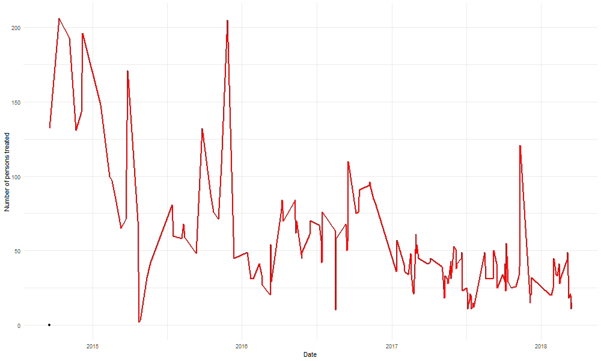
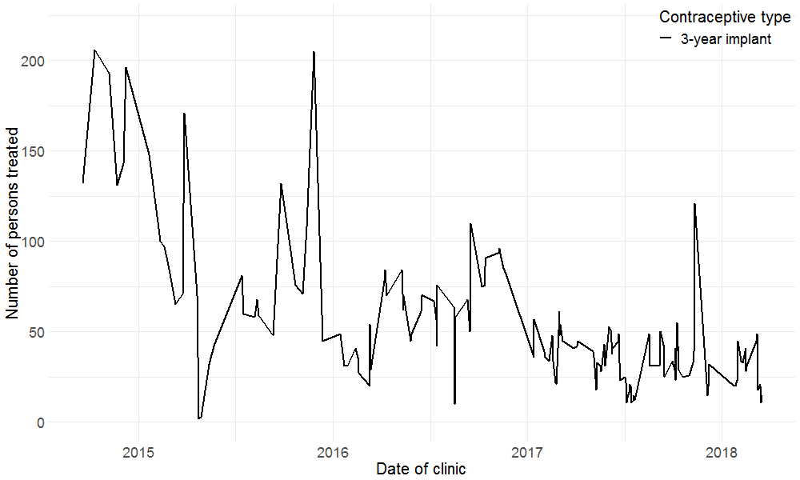

### The impact of integrated healthcare and family planning services in marginalised communities in rural areas in Kenya and Uganda 
```{r echo = FALSE}

```


---

## Outline 

--

* Simple Time Series

--

* Aggregated Time Series

--

* Derived variables
  + Rates
  + Couple Years of Protection 

--

* Data Management

--

* Analysis Pipeline


---

### Analysis - Simple Time Series

```{r echo = FALSE}
knitr::include_graphics("figures/fp_lt_3yr_line.gif")
```

.small[3-year implant delivery (Dandelion 2014-2018)]
---

### Analysis - Simple Time Series

```{r echo = FALSE}

```

.small[3-year and 5-year implant delivery (Dandelion 2014-2018)]

---
### Analysis - Simple Time Series

```{r echo = FALSE}

```

.small[3-year and implant delivery with LOESS curve (Dandelion 2014-2018)]