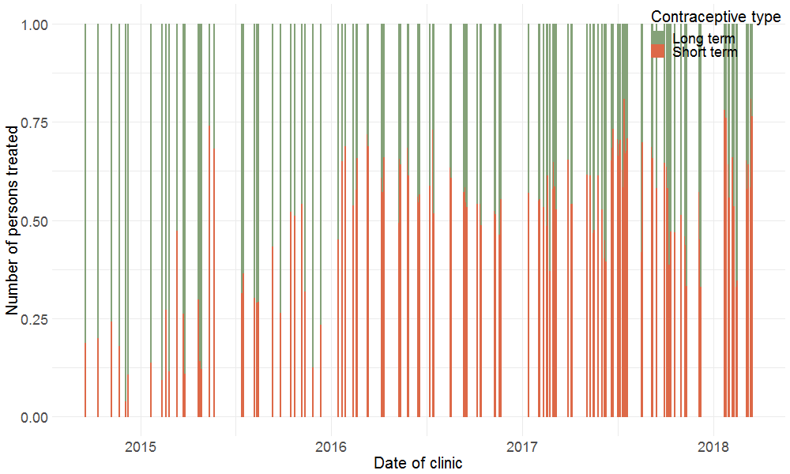

### The impact of integrated healthcare and family planning services in marginalised communities in rural areas in Kenya and Uganda 
```{r echo = FALSE}
knitr::include_graphics("figures/page-header-3.jpg")
```


---

## Outline 

--

* Simple Time Series

--

* Aggregated Time Series

--

* Derived variables
  + Rates
  + Couple Years of Protection 

--

* Data Management & Analysis Pipeline


---

### Simple Time Series

```{r echo = FALSE}
knitr::include_graphics("figures/fp_lt_3yr_line.gif")
```

.small[3-year implant delivery (Dandelion 2014-2018)]
---

### Simple Time Series

```{r echo = FALSE}
knitr::include_graphics("figures/fp_lt_3yr_add_5yr_line.gif")
```

.small[3-year and 5-year implant delivery (Dandelion 2014-2018)]

---
### Simple Time Series & smooth curves

```{r echo = FALSE}
knitr::include_graphics("figures/fp_lt_3yr_add_smooth.gif")
```

.small[3-year and implant delivery with LOESS curve (Dandelion 2014-2018)]

---
### Simple Time Series & smooth curves

```{r echo = FALSE}

```

.small[Immunization delivery with LOESS curve (Dandelion 2014-2018)]

---
### Simple Time Series & smooth curves

```{r echo = FALSE}

```

.small[Depo injection delivery with two different LOESS curves (Dandelion 2014-2018)]

---
### Aggregated Time Series: Funding rounds

```{r echo = FALSE}
knitr::include_graphics("figures/fp_lt_st_funding_round.gif")
```

.small[Long and short term contraceptive delivery by funding round (Dandelion 2014-2018)]

---
### Aggregated Time Series: Annual totals

```{r echo = FALSE}


```
.small[Long and short term contraceptive delivery by funding year (Dandelion 2014-2018)]

---
### Aggregated Time Series: Annual totals

```{r echo = FALSE}


```
.small[Total delivery of six main contraceptive types by funding year (Dandelion 2014-2018)]

---
### Rates 

```{r echo = FALSE}

```

.small[Proportion of long-term and short-term contraceptives at each clinic (Dandelion 2014-2018)]

---
### Rates 

```{r echo = FALSE}

```

.small[Proportion of long-term and short-term contraceptives in each funding round(Dandelion 2014-2018)]

---
### Rates 

```{r echo = FALSE}

```

.small[Proportion of long-term and short-term contraceptives for each year (Dandelion 2014-2018)]
---
### CYP Analysis - Cost

```{r echo = FALSE}

```

.small[Cost (in GBP) of one Couple Year of Protection (CYP) in each funding round (Dandelion 2014-2018)]

---
### CYP Analysis - Cost

```{r echo = FALSE}

```

.small[Cost (in GBP) of one Couple Year of Protection (CYP) for each year (Dandelion 2014-2018)]

---
### CYP Analysis - Cost

```{r echo = FALSE}

```

.small[CYP cost by number of people receiving family planning in each funding round (Dandelion 2014-2018)]

---
### CYP Analysis - Structure

```{r echo = FALSE}
knitr::include_graphics("figures/cyp_str_rounds.gif")
```

.small[Structure of CYP provided by different contraceptive types in each funding round (Dandelion 2014-2018)]
---
### CYP Analysis - Structure

```{r echo = FALSE}

```

.small[Structure of CYP provided by different contraceptive types for every year (Dandelion 2014-2018)]


---
### Data Management & Analysis Pipeline

--

* Data *janitor work* -> Tidy data

* Data input and error checking

* Transparency and Reproducibility

* Interactivity?
