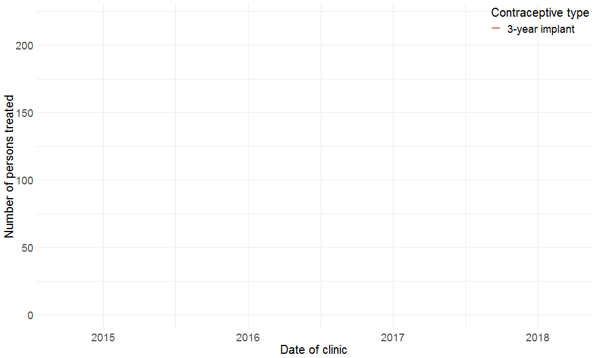
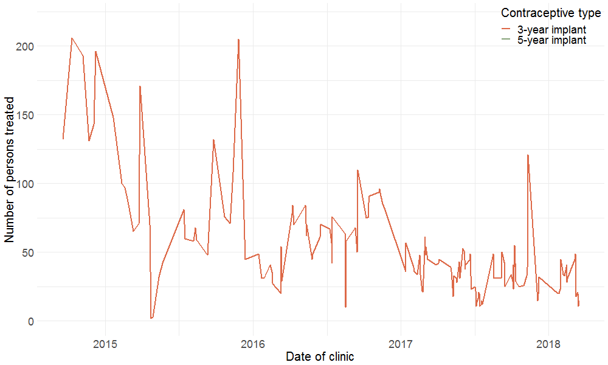

### The impact of integrated healthcare and family planning services in marginalised communities in rural areas in Kenya and Uganda 
```{r echo = FALSE}
knitr::include_graphics("figures/page-header-3.jpg")
```


---

## Outline 


---

## Analysis - Simple Time Series

```{r echo = FALSE}

```

---

## Analysis - Simple Time Series

```{r echo = FALSE}

```